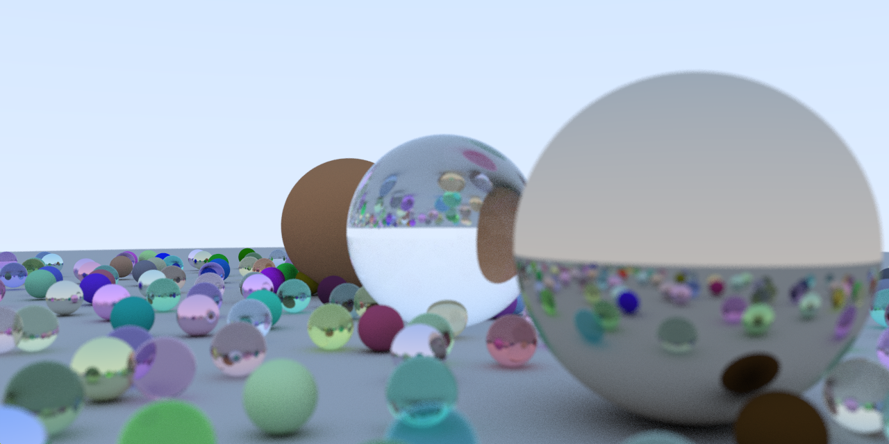
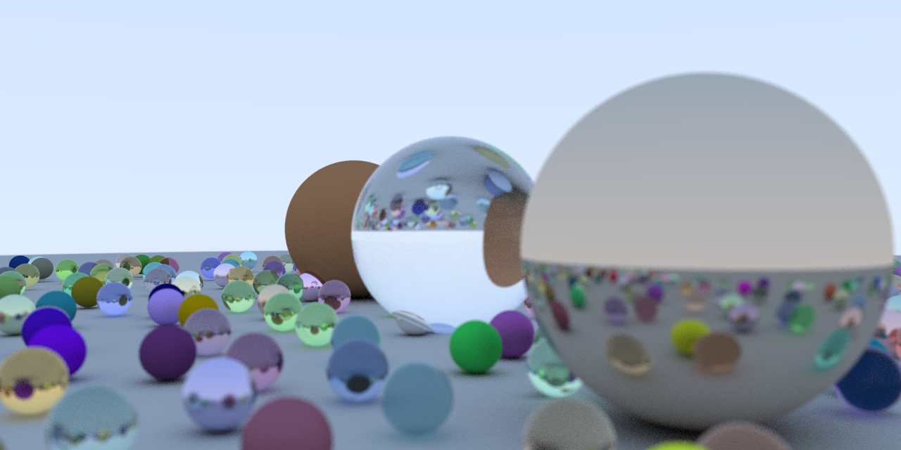

# CL-Ray

The C99 adaptation of Peter Shirley's [Ray Tracing in One Weekend](http://www.realtimerendering.com/raytracing/Ray%20Tracing%20in%20a%20Weekend.pdf) ([code ref](https://github.com/petershirley/raytracinginoneweekend)).

It is used as a performance reference for other implementations (e.g. in C#). It may be a foundation for some future experiments.

In addition to the features in Shirley's code, this adaptation also includes:

- uniformed material representation
- an iterative renderer
- cross-platform support
- acceleration using OpenCL

For a comparison basis, currently it runs at 60M to 70M samples/s (single-threaded, i7-4712MQ).

## On Using OpenCL

When enabled, this program will run (a part of) itself using OpenCL acceleration.
It tries to load the sources, and searches for headers from `../src`, so you should run it from the `bin` directory to make it work.

You have to pay extreme attention to the byte alignments in OpenCL.
Please check the commit history to see the differences in structure definitions.
All fields were aligned by 4 bytes, but that was not enough and caused severe data corruption (which is inside the graphics card and hard to debug).
Finally I followed the suggestion from [here](https://stackoverflow.com/a/17374931), and aligned all fields by 16 bytes by adding paddings. Then it worked as expected.

Embracing [SYCL](https://www.khronos.org/sycl/) does not help in this program.
The compiler (the ComputeCPP one) *does not* analyze call references, which means you have to write the whole kernel *inside* a local lambda.
This is definitely a nightmare for a sophisticated program like the one here, which is divided into components.

The acceleration is quite obvious. My standalone GPU reduced the time from ~24 mins (on CPU) to ~1 min rendering the same or similar scene, with the same pixel dimensions.
But it suffers from mild precision loss.

## License

BSD 3-Clause License
